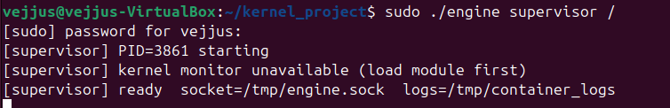
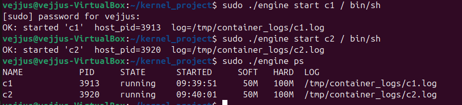
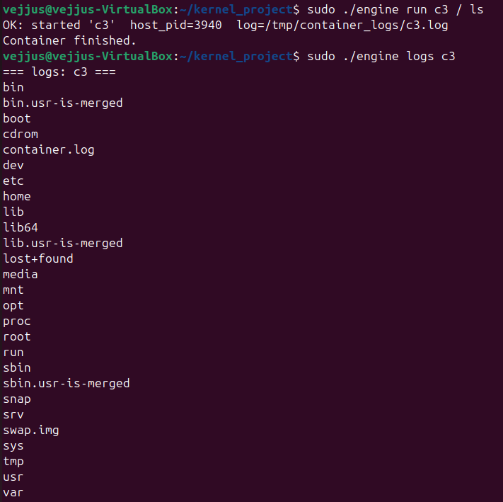
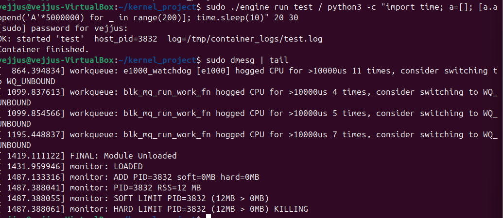
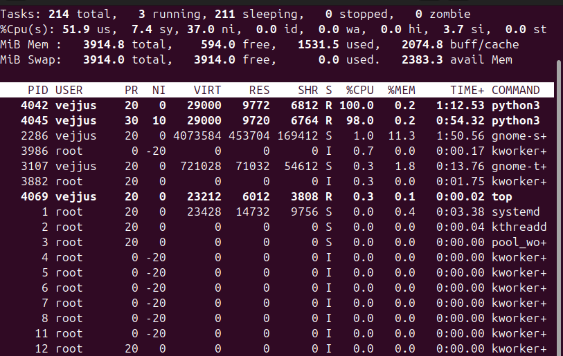
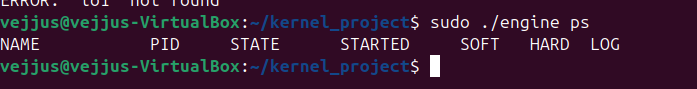

# Operating Systems - Mini Project

## Project Title
Multi-Container Runtime with Kernel Memory Monitoring

## Team Information
Team Member 1: Shree Krishna [PES1UG24CS440]  
Team Member 2: Sruthi Vejju [PES1UG24CS472]

---

## 1. Project Overview

This project builds a lightweight Linux container runtime in C with:

- a long-running supervisor
- multiple containers running at the same time
- a CLI for container management
- bounded-buffer logging
- a Linux kernel module for RSS-based memory monitoring and enforcement

The user-space runtime creates isolated container environments using Linux namespaces and `chroot`, while the kernel module tracks container processes through `ioctl` and enforces soft and hard memory limits.

---

## 2. Main Features

- Start, run, stop, and inspect containers
- Manage multiple containers concurrently
- Isolated PID, UTS, and mount namespaces
- Separate writable root filesystem per container
- `/proc` support inside container
- Safe logging through pipes and a bounded buffer
- Kernel-side process tracking using a character device and `ioctl`
- Soft-limit warning and hard-limit kill behavior
- Scheduler experiment support using different workloads and priorities

---

## Design and Implementation Details

### Container Isolation
The runtime uses Linux namespaces to isolate containers:
- **PID namespace** ensures each container has its own process tree.
- **UTS namespace** allows separate hostnames.
- **Mount namespace** isolates filesystem mounts.

Each container uses `chroot()` to create a separate root filesystem and mounts `/proc` inside the container.

---

### Supervisor Architecture
A long-running supervisor process manages all containers. It:
- Listens on a UNIX domain socket (`/tmp/engine.sock`)
- Accepts commands like start, run, stop, ps, and logs
- Maintains metadata of all containers (PID, state, limits, logs)

The CLI acts as a client and communicates with the supervisor using sockets.

---

### Logging System (Bounded Buffer)
Container output is captured using pipes and handled using a producer-consumer model:
- Producer threads read container output
- A bounded buffer stores log data
- A consumer thread writes logs to files in `/tmp/container_logs`

This ensures safe and efficient logging without data loss.

---

### Kernel-User Communication
The user-space runtime communicates with the kernel module using `ioctl`.

- `IOCTL_ADD_PROCESS` registers a container process
- `IOCTL_REMOVE_PROCESS` removes it when finished

The kernel module tracks processes and monitors memory usage.

---

### Memory Monitoring
The kernel module periodically checks the RSS (Resident Set Size) of each process.

- If memory exceeds the **soft limit**, a warning is logged
- If memory exceeds the **hard limit**, the process is killed using `SIGKILL`

This ensures controlled memory usage across containers.

---

### Scheduling Experiment
Scheduling behavior was demonstrated using CPU-bound processes with different nice values.

Two processes were run with different priorities and observed using system tools like `top`, showing how Linux scheduler allocates CPU time.

---

### Design Decisions
- Lightweight containerization using namespaces instead of full virtualization
- Use of UNIX sockets for simple and efficient IPC
- Bounded buffer for safe multi-threaded logging
- Kernel module for low-level memory monitoring

---

### Limitations
- Containers are short-lived and not persistent
- Limited filesystem isolation compared to full container systems
- Basic scheduling demonstration without advanced policies

## 3. Repository Contents

- `engine.c` — user-space runtime / supervisor / CLI
- `monitor.c` — kernel module
- `monitor_ioctl.h` — shared ioctl definitions
- `Makefile` — build instructions
- `mem_test.c` — memory stress test
- `test.c` — ioctl test program
- `README.md` — this file

---

## 4. Environment Requirements

Use:

- Ubuntu 22.04 or 24.04
- VirtualBox VM
- Secure Boot OFF
- Kernel headers installed

Install dependencies:

```bash
sudo apt update
sudo apt install -y build-essential dkms linux-headers-$(uname -r)
```

---

## 5. Build Instructions

Build the project:

```bash
make
```

- Build the user-space engine (if needed):

```bash
gcc -pthread -o engine engine.c
```

- Clean build files:

```bash
make clean
rm -f engine mem_test test
```

---

## 6. Kernel Module Setup

Load module:

```bash
sudo insmod monitor.ko
```

Verify device:

```bash
ls -l /dev/container_monitor

Check kernel logs:

sudo dmesg | tail
```

Unload module:

```bash
sudo rmmod monitor
```
---

## 7. Running the Project

Start the supervisor:

```bash
sudo ./engine supervisor <base-rootfs>

Example:
sudo ./engine supervisor /

Start a container:

sudo ./engine start <id> <container-rootfs> <command> [soft_mb] [hard_mb]
```

Run a one-shot container:

```bash
sudo ./engine run <id> <container-rootfs> <command> [soft_mb] [hard_mb]

Example:

sudo ./engine run c1 / bin/ls

List containers:

sudo ./engine ps
```

View logs:

```bash
sudo ./engine logs <id>

Stop container:

sudo ./engine stop <id>
```

## 8. CLI Commands

```bash
engine supervisor <base-rootfs>

engine start <id> <container-rootfs> <command> [soft_mb] [hard_mb]

engine run <id> <container-rootfs> <command> [soft_mb] [hard_mb]

engine ps

engine logs <id>

engine stop <id>
```

Note: Memory limits are provided as positional arguments (soft_mb and hard_mb) instead of flags.

## 9. Design Summary

User-space side:

- Creates containers
- Manages lifecycle
- Communicates with kernel using ioctl
- Tracks metadata
- Handles logging and cleanup

Kernel-side:

- Creates /dev/container_monitor
- Stores process data
- Monitors RSS
- Triggers soft warnings
- Enforces hard limits (kills process)

Scheduling behavior was demonstrated using CPU-bound processes with different nice values observed using system tools like top.

## 10. Team Work Split

Team Member 1:

- engine.c
- Container creation
- CLI / supervisor
- Rootfs handling
- Namespace setup
- Logging

Team Member 2:

- monitor.c
- monitor_ioctl.h
- Device creation
- ioctl handling
- Kernel linked list
- Memory monitoring

## 11. Demo Screenshots

### 1. Supervisor Running


### 2. Multiple Containers Running


### 3. Container Metadata


### 4. Container Logs Output


### 5. Soft Limit Detection


- The scheduling experiment was demonstrated using two CPU-bound python3 processes with different nice values, observed through top.
  
### 6. Hard Limit Enforcement (Kill)


### 7. CPU Scheduling Experiment


### 8. Clean Teardown



## 12. Cleanup

```bash
make clean
rm -f engine mem_test test
sudo rmmod monitor
```

## 14. Troubleshooting

```bash
insmod: File exists
→ Module already loaded:

sudo rmmod monitor
sudo insmod monitor.ko

Permission denied (GitHub)
→ Use Personal Access Token instead of password

dmesg not permitted:

sudo dmesg | tail
```

## 14. Notes

This project demonstrates:

- Container isolation using namespaces
- Kernel-user communication using ioctl
- Process monitoring and tracking
- Memory enforcement
- Scheduling behavior
- Proper resource cleanup
